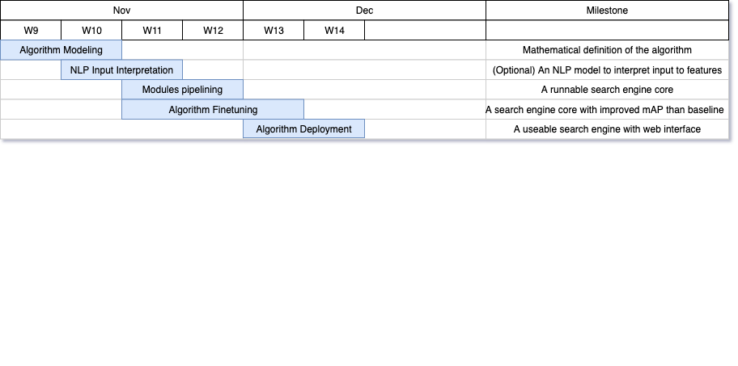

# SI 650 Project Update

Mingliang Duanmu, Yucheng Gu

## Introduction

[Full Project Proposal](https://docs.google.com/document/d/1a3QYOwUn5mF9JrrGLS7jSMhVH0VTeneSbQYCqbb60Xs/edit?usp=sharing)

Our project aims to build a second-hand car search engine for people **who do not know cars well**. Our system will take in a query containing general descriptions of the expectations of the user, and return a list of second-hand cars available on the market that best suits the requirements of the user, in the order of relevance.

## Data

Source of data: [cars.com](https://cars.com)

**How you obtain it:**

We first downloaded link to 9,975 second-hand cars. This is achieved by first using Python's request module, then extracting the links using Beautifulsoup module. Then for each link, the request - Beautifulsoup mode is repeated to retrieve information. The website maintains a relatively well-structured HTML code, so it is not difficult to extract all the features we need from different locations on the page.

**Preprocessing steps:**

The formatted data is in JSON form, with only four fields, in which two fields are dictionaries of features. The first step of preprocessing is to expand all features as the columns of the dataset. The second step is to separate simple information like year and turbo from the name and engine of the car. The third step is extracting drivetrain, fuel type, emission, number & type of cylinders, average MPG and transmission number from the original feature column. In this step, regular expression is frequently used to obtain information from original data, since the format is not uniform across each line of data, for example, "2.0L", "2.0 L", "2.0" can all lead to a 2.0 emission volume. Also, we are mapping drivetrain and fuel type into less categories to simplify classification, for example, "E85 Flex Fuel" and "Flexible Fuel" can be treated as in the same class. In addition, we classify the columns with only logical values indicating whether the car has a certain function into three groups: safety, comfort, and multimedia configuration, so the further filter criteria can be built on these groups. 

The following tables shows some basic statistics of the dataset.

| Item                                             | Number |
| ------------------------------------------------ | ------ |
| Total cars                                       | 9204   |
| Average price                                    | 39279  |
| Number of cars under $60000 (Cheap & Moderate)   | 8225   |
| Number of cars with full configurations          | 252    |
| Percentage of All-wheel drive car                | 64.05% |
| Percentage of cars with model after year 2016    | 83.04% |
| Percentage of cars with emission volume over 3.0 | 57.14% |
| Percentage of electric cars                      | 1.54%  |

**Manual annotation rules**

As the relevance scores of our documents largely depends on the query, we create 20 sample queries and annotate the score manually for 100 documents each query. For the first ten example queries, the statement is straightforward on the requirements of the car, while for the last ten, the search engine should do some interpretations of the description for evaluating each feature to get the final score.

*Query list for annotation:*

1. I want a red car with heated seats.
2. I want a blue car with CarPlay.
3. I want an old and cheap car with emission volume of 3.0.
4. I want an expensive car with all configurations.
5. I want a black car with navigation system and moderate price.
6. I want a car with high performance.
7. I want a Tesla electric car at lowest price.
8. I want a cheap V-8 engine car.
9. I want a white car with rich technology.
10. I want a diesel-driven car with high engine power.
11. I want a small emission volume car with CarPlay.
12. I want a light-color 2018 Ford SUV.
13. I want a red car with high safety configurations.
14. I want to keep warm in winter and start the car remotely.
15. I am a student searching for a cost-effective car for school.
16. I am a racecar lover with limited budget.
17. I want a car with rich gear levels and high horse power.
18. I want a white four-wheels-drive BMW sedan.
19. I am a new driver seeking for a moderate emission volume car with moderate price.
20. I want an SUV with good performance in snowy weather.

Our steps for scoring is to first decide whether a document satisfies the features mentioned in the query, then make judgements on the rest features. We are determining the final score of a document using an accumulative pattern. If a document suits a feature addressed by the query, 1 point is added to the final score. For features not mentioned, up to 0.2 points will be added for each if it satisfies the ***general rule of selection***.

Our ***general rule of selection*** is: 

1. For cars within 25% and 75% quartile of the price range of all candidates satisfying the query features, the extra score increase linearly up to 0.2 as it approaches the mean.
2. For each of the eight configuration features, 0.025 points is added if the car has it.
3. For transmission, the more gears, the higher extra points.
4. The greater cylinder number, the higher extra points.
5. For other features, no extra points.
6. Cars with any insufficient information will be given a zero score in any case.

## Related Work

In this project, the goal is to achieve a perpendicular IR system. There are some works in IR field that does a similar job, but of course on different topics. For instance, in "Rapidly Deploying a Neural Search Engine for the COVID-19 Open Research Dataset: Preliminary Thoughts and Lessons Learned", Zhang et al. presented a search engine on COVID-19 Open Research Dataset. They used Anserini for indexing, and used seq2seq models to build the ranker. These are the methods we can draw lesson from, as we currently have enough GPU resource at-hand, using neural networks is a possible approach. However, they are also vague on the evaluation, as they insist that the evaluation requires a correct result on the dataset, which they were not sure of. In our case since the dataset is not large, we could have better evaluation methods.

In "MedKnowts: Unified Documentation and Information Retrieval for Electronic Health Records", Murray et al. also works on a specific field, which is clinical documentations. They discussed heavily on the implementations, which is helpful for us when building the web interface. 

In their "Document Ranking with a Pretrained Sequence-to-Sequence Model", Nogueira et al. also used seq2seq models in document ranking. Instead of working on perpendicular fields, they tested their method on MS MARCO passage and Robust04 datasets, which makes the results more generalizable. The seq2deq model is a encoder-decoder architectured model transforming text to text and then do a reranking. We believe this method is applicable to our situation, if computational power allows.

Prakash discussed techniques for query understanding in his report "Techniques for Deep Query Understanding". According to him, query understanding have a few phases including query correction, query suggestion, query expansion, query classification and semanic tagging. We believe for our preprocess of query to work, query expansion and semanic tagging are necessary. These are the aspects we will pay most attention to.

Finally, other methods are also worth considering. Liu et al. proposed a cascade procedure in their "Cascade ranking for operational e-commerce search". The procedure cascades a few ranking functions in series for training and inference. This method effectively deals with queries involving multiple factors of preferences or constraints. 


## Methodology

We will convert all features to a single document string of the same structure, interpreting numerical numbers to word expressions, so that we can use existing ranking functions like TF-IDF, BM-25 and probability models.

For some important features such as price, we will create numerical bins as complement, such as price ranging \$0~\$15000 as "cheap", \$15000~\$30000 as "moderate", and \$30000+ as "expensive".

The search engine is intended to funtion with natural language inputs. Therefore, we plan to tryout some Named Entity Recognition (NER) methods in Python. Spacy has some supports, therefore we will start with it. We might need to train our models for this to work. If this approach  doesn't work, we will also try to use pattern recognition to extract information from the query. 

## Evaluation and Results

For evaluation, we used Pyserini to index and run a BM25 base line first. The features we extracted are concated into a single string as the document. The querys are searched on this document, we show a part of the results here (see Data part for the queries):

```
1 - I want a red car with heated seats.
	 ➤ doc 3064 - 2008 Chevrolet Corvette Indy Pace Car, 19995, Red, Red, Rear-wheel Drive, Transmission, Gasoline, 6-Speed Automatic, 6.2L V8 16V MPFI OHV, 137050, heated_seats, heated_steering_wheel, nav_sys, remote_start, carplay, bluetooth, brake_assist, blind_spot_monitor
	 ➤ doc 1821 - 2011 Dodge Ram 1500 20 WHEELS SEATS PKG, 17985, Gray, Dark Slate / Medium Greystone, Four-wheel Drive, 13–18, Gasoline, Automatic, 5.7L V8 16V MPFI OHV, 87028, heated_seats, heated_steering_wheel, nav_sys, remote_start, carplay, bluetooth, brake_assist, blind_spot_monitor
	 ➤ doc 3085 - 2004 Lincoln Town Car Ultimate L, 7995, Gold, Light Parchment, Rear-wheel Drive, 17–25, Gasoline, 4-Speed Automatic, 4.6L V8 16V MPFI SOHC, 98355, heated_seats, heated_steering_wheel, nav_sys, remote_start, carplay, bluetooth, brake_assist, blind_spot_monitor
2 - I want a blue car with CarPlay.
	 ➤ doc 3064 - 2008 Chevrolet Corvette Indy Pace Car, 19995, Red, Red, Rear-wheel Drive, Transmission, Gasoline, 6-Speed Automatic, 6.2L V8 16V MPFI OHV, 137050, heated_seats, heated_steering_wheel, nav_sys, remote_start, carplay, bluetooth, brake_assist, blind_spot_monitor
	 ➤ doc 3085 - 2004 Lincoln Town Car Ultimate L, 7995, Gold, Light Parchment, Rear-wheel Drive, 17–25, Gasoline, 4-Speed Automatic, 4.6L V8 16V MPFI SOHC, 98355, heated_seats, heated_steering_wheel, nav_sys, remote_start, carplay, bluetooth, brake_assist, blind_spot_monitor
	 ➤ doc 3102 - 2008 BMW 128 i, 8900, Blue, Beige, RWD, 18–28, Gasoline, 6-Speed Automatic, 3.0L I6 24V MPFI DOHC, 92584, heated_seats, heated_steering_wheel, nav_sys, remote_start, carplay, bluetooth, brake_assist, blind_spot_monitor
```

To evaluate the effectiveness of this baseline, the queried results are manually marked as relevant/irrelavant. Then, we calculate the mAP of the baseline. The calculated results for each query are listed as:

```
1 - MAP=0.4200
2 - MAP=0.2867
3 - MAP=0.0400
4 - MAP=0.0400
5 - MAP=0.0400
6 - MAP=0.5433
7 - MAP=0.0667
8 - MAP=0.2867
9 - MAP=0.2000
10 - MAP=0.6433
11 - MAP=0.1300
12 - MAP=0.0667
13 - MAP=0.2000
14 - MAP=1.0000
15 - MAP=0.1000
16 - MAP=0.2000
17 - MAP=0.2333
18 - MAP=0.4200
19 - MAP=0.0000
20 - MAP=0.0000
```

The evaluation shows that for some queries BM25 performs well, but it doesn't perform well on most of the queries. For the queries do work well, we also suspect the effectiveness as they actually reflect some bias in our data. For example, query 14 asks that "I want to keep warm in winter and start the car remotely". Since cars.com requires the buyer's location, even if we've set the diameter as infinite, the crawled data is still scattered in a large circle around Ann Arbor. And most cars in Michigan do have heated devices since winters in Michigan are cold. 

We are currently working on a simple web-based annotation tool to help annotate results.Amazon MTurk may also be used to annotate our results, if the number is too large. Later when we refine our algorithm, we will use the same method as we evaluate this baseline to test the effectiveness, and compare the result with the above mAP result.

## Work Plan

### What is done so far

We've finished project formulation, data collection and cleaning as we expected. We've inspected data through this process and have learned some useful information from it. We've also developed a baseline result, as well as a procedural evaluation process. 

### What we intended to do

Based on the tentative timeline we submitted in the proposal, we added a few specific tasks to be done. The finished tasks are deleted from the timeline, the rest of the timeline is:

